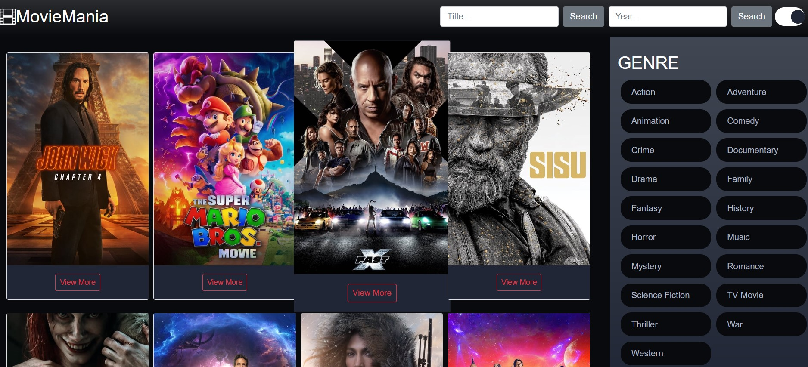

<h1 align="center"> MovieMania</h1>
MovieMania - це додаток, створений за допомогою фреймворку React, з використанням бібліотеки стилів Bootstrap.
Додаток створений як фінальний проєкт з курсу Front-End Development школи robot_dreams, для закріплення надбаних знань та навичок в галузі html, css та js, і фреймворку React, використання  fetch-запитів API.

# 🍿 Функціонал
- Пошук фільмів: користувач може здійснювати пошук фільмів за назвою
- Відображення за жанрами: фільми можна сортувати за жанрами
- Відомості про фільм: користувач можe переглянути детальну інформацію про кожен фільм
- Додати фільми до обраного: користувач може додати свої улюблені фільми в закладки для подальшого перегляду

# 🍿 Технології

- ReactJS
- TMDB API

# 🍿 Для запуску додатку треба:

## Крок 1:

- налаштувати оточення Node.js не нище версії 14.0.0 та пакетний менеджер npm не нище версії 5.6 або yarn версії 1.0;
- встановити npm install або yarn install;
- склонувати собі репозиторій за адресою https://github.com/rudiukhanna/movie-app.git;
- ввести в Терміналі (iOS), командному рядку (PowerShell for Windows) або безпосередньо в Терміналі IDE (наприклад, VS Code) команду
          cd movie-app npm start 
    або   
          cd movie-app yarn start

## Крок 2: Отримати TMDB Key
- Перейдіть на сторінку https://www.themoviedb.org/ і увійдіть.
- Натисніть на зображення свого профілю користувача на панелі навігації та виберіть «Налаштування».
- В налаштуваннях виберіть «API» та згенеруйте ключ API.

# 🍿 Тестування коду
Тестування додатку виконувалось у вигляді unit tests (тестування найменших одиниць коду - компонентів) та за допомогою бібліотеки React Testing Library. Таке тестування проводилось з метою перевірки, чи працюють компоненти та функції окремо від інших частин додатка.
Щоб запустити файли з тестами потрібно:

 - встановити бібліотеку React Testing Library
      (команда npm install --save-dev @testing-library/react @testing-library/jest-dom)
    або 
      ( команда yarn add --dev @testing-library/react)
      
  - запустити тести за допомогою команди npm test або yarn test;

